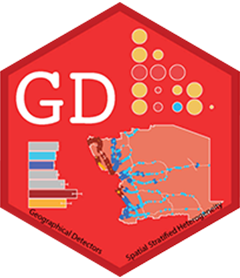

<!-- README.md is generated from README.Rmd. Please edit that file -->

# GD <a href="https://ausgis.github.io/GD/"></a>

<!-- badges: start -->

[](https://CRAN.R-project.org/package=GD)
[](https://CRAN.R-project.org/package=GD)
[](https://CRAN.R-project.org/package=GD)
[](https://ausgis.r-universe.dev/GD)
[](https://doi.org/10.1080/15481603.2020.1760434)

<!-- badges: end -->

**Geographical Detectors for Assessing Spatial Factors**

Please cite **GD** as:

> Song, Y., Wang, J., Ge, Y. & Xu, C. (2020) An optimal parameters-based
> geographical detector model enhances geographic characteristics of
> explanatory variables for spatial heterogeneity analysis: Cases with
> different types of spatial data, *GIScience & Remote Sensing*,*57*(5),
> 593-610. <https://doi.org/10.1080/15481603.2020.1760434>.

A BibTeX entry for LaTeX users is:

``` bib
@article{Song2020opgd,
author = {Yongze Song, Jinfeng Wang, Yong Ge and Chengdong Xu},
title = {An optimal parameters-based geographical detector model enhances geographic characteristics of explanatory variables for spatial heterogeneity analysis: cases with different types of spatial data},
journal = {GIScience \& Remote Sensing},
volume = {57},
number = {5},
pages = {593--610},
year = {2020},
month = {05},
publisher = {Taylor \& Francis},
doi = {10.1080/15481603.2020.1760434},
URL = {https://doi.org/10.1080/15481603.2020.1760434}
}
```

## Installation

- Install from [CRAN](https://CRAN.R-project.org/package=GD) with:

``` r
install.packages("GD")
```

- Install development binary version from
  [R-universe](https://ausgis.r-universe.dev/GD) with:

``` r
install.packages("GD",repos = c("https://ausgis.r-universe.dev",
                                "https://cloud.r-project.org"))
```

- Install development source version from
  [GitHub](https://github.com/ausgis/GD) with:

``` r
# install.packages("devtools")
devtools::install_github("ausgis/GD",build_vignettes = TRUE)
```
