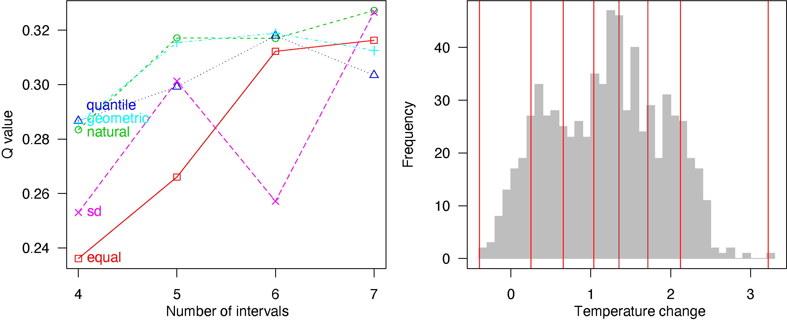
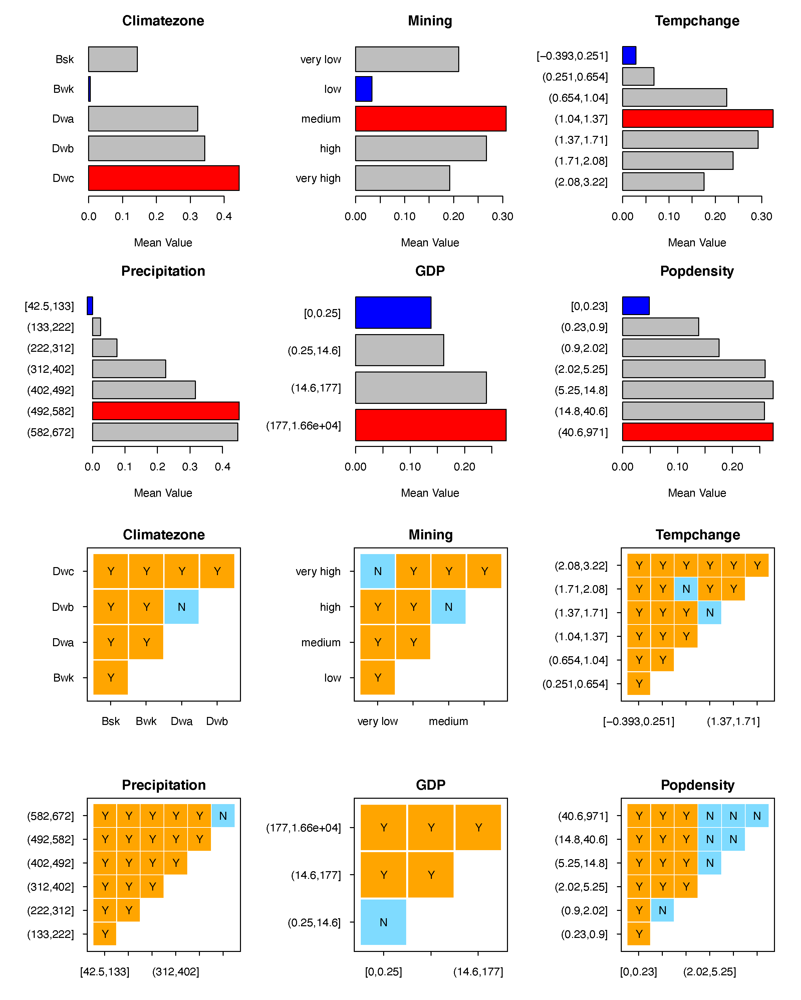
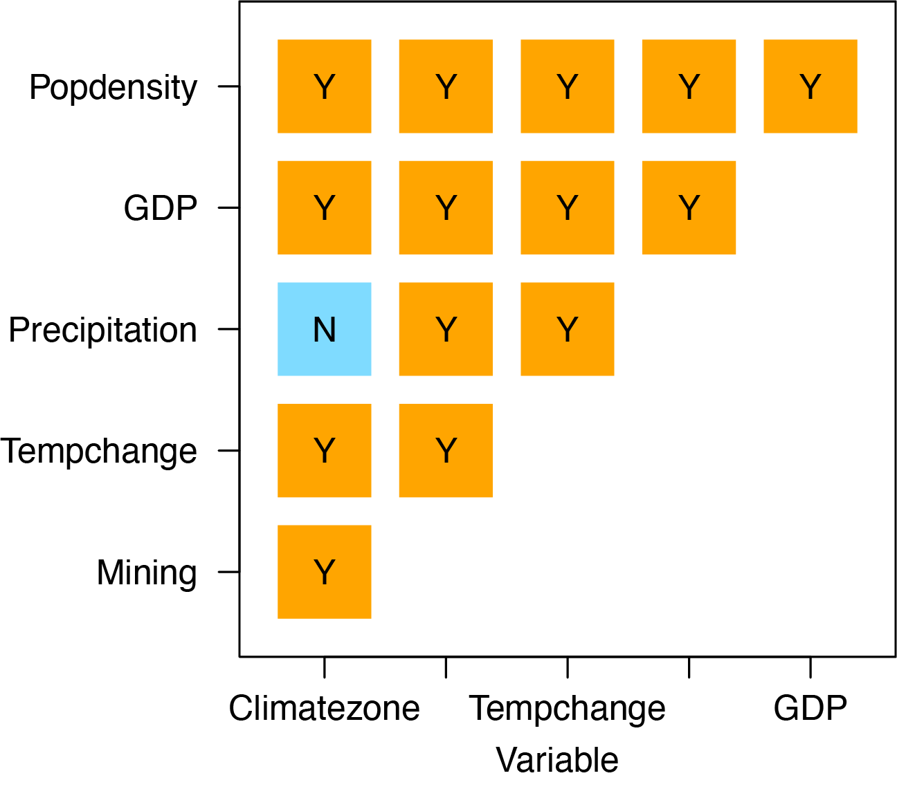

```{r setup, include=FALSE}
knitr::opts_chunk$set(
  echo = TRUE,
  comment = "##"
)
```


&nbsp; 


`Current version: GD v10.5`


&nbsp; 


### Citation for package `GD`

To cite **`GD` R package** in publications, please use:

**Song, Y., Wang, J., Ge, Y. & Xu, C. (2020) "An optimal parameters-based geographical detector model enhances geographic characteristics of explanatory variables for spatial heterogeneity analysis: Cases with different types of spatial data", GIScience & Remote Sensing. 57(5), 593-610. doi: [10.1080/15481603.2020.1760434][7].**

&nbsp; 


### Authors’ affiliations

**Dr. Yongze Song**

[Google Scholar][6], [ResearchGate][11]

Research interests: Spatial statistics, sustainable infrastructure

Curtin University, Australia

Email: yongze.song@curtin.edu.au


&nbsp; 

## 1. Introduction to `GD` package

### 1.1 The model can be used to address following issues:

- Explore potential factors or explanatory variables from a spatial perspective.

- Explore potential interactive impacts of geogrpahical variables.

- Identify high-risk or low-risk regions from potential explanatory variables. 

### 1.2 The `GD` package makes following steps fast and easy:

- It contains both supervised and unsupervised spatial data discretization methods, and the optimal spatial discretization method for continuous variables; 

- It contains four primary functions of geographical detectors, including factor detector, risk detector, interaction detector and ecological detector;

- It can be used to compare size effects of spatial unit;

- It provides diverse visualizations of spatial analysis results;

- It contains detailed significance tests for spatial analysis in each step of geographical detectors. 


### 1.3 Start from the *one-step function*: `gdm` (*Highly Recommended*)

The pacakge provides a one-step function for performing optimal discretization and geographical detectors at the same time.  

**The output contains all data and visualization results.**

```{r, eval = FALSE}
## install and library the pacakge
install.packages("GD")
library("GD")

## Example 1
## NDVI: ndvi_40
## set optional parameters of optimal discretization
## optional methods: equal, natural, quantile, geometric, sd and manual
discmethod <- c("equal","natural","quantile")
discitv <- c(4:6)
## "gdm" function
## In this case, Climatezone and Mining are categorical variables,
## and Tempchange and GDP are continuous variables.
ndvigdm <- gdm(NDVIchange ~ Climatezone + Mining + Tempchange + GDP,
               continuous_variable = c("Tempchange", "GDP"),
               data = ndvi_40,
               discmethod = discmethod, discitv = discitv) # ~3s
ndvigdm
plot(ndvigdm)

## Example 2
## H1N1: h1n1_100
## set optional parameters of optimal discretization
discmethod <- c("equal","natural","quantile","geometric","sd")
discitv <- c(3:7)
continuous_variable <- colnames(h1n1_100)[-c(1,11)]
## "gdm" function
h1n1gdm <- gdm(H1N1 ~ .,
               continuous_variable = continuous_variable,
               data = h1n1_100,
               discmethod = discmethod, discitv = discitv)
h1n1gdm
plot(h1n1gdm)
```

### 1.4 Advanced models

Currently, there are the following advanced models based on spatial stratified heterogeneity. 

| Model (Publication)                                                                                                                               | Description                                                                                                                                                                                                                                                                |
|:--------------------------------------------------------------------------------------------------------------------------------------------------|:---------------------------------------------------------------------------------------------------------------------------------------------------------------------------------------------------------------------------------------------------------------------------|
| Optimal Parameters-based Geographical Detector (OPGD) [(Song et al., 2020)][2]                                                                    | OPGD is used for characterising spatial heterogeneity, identifying geographical factors and interactive impacts of factors, and estimating risks.                                                                                                                          |
| Interactive Detector for Spatial Associations (IDSA) [(Song et al., 2021)][12]                         | IDSA is used for estimating the power of interactive determinants (PID) from a spatial perspective. The IDSA model considers spatial heterogeneity, spatial autocorrelation, and spatial fuzzy overlay of multiple explanatory variables for calculating PID.              |
| Generalized Heterogeneity Model (GHM) [(Luo et al., 2023)][13]                                         | GHM is used for characterizing local and stratified heterogeneity within variables and to improve interpolation accuracy.                                                                                                                                                  |
| Geographically Optimal Zones-based Heterogeneity (GOZH) [(Luo et al., 2022)][14] | GOZH is used for identifying individual and interactive determinants of geographical attributes (e.g., global soil moisture) across a large study area. GOZH can identify optimal spatial zones and compute the maximum power of determinant (PD) values using an Ω-index. |
| Robust Geographical Detector (RGD) [(Zhang et al., 2022)][15]                    | RGD is used for the robust estimation of PD values.                                                                                                                                                                                                                  |


&nbsp; 

## 2. Geographical detector model

Spatial stratified heterogeneity can be measured using geographical detectors ([Wang et al. 2010][2], [Wang et al. 2016][3]). 

Power of determinants is computed using a $Q$-statistic:

$$Q=1-\displaystyle \frac{\sum_{j=1}^{M} N_{j} \sigma_{j}^2}{N \sigma^2} $$

where $N$ and $\sigma^2$ are the number and population variance of observations within the whole study area, and $N_{j}$ and $\sigma_{j}^2$ are the number and population variance of observations within the $j$ th ($j$=1,…,$M$) sub-region of an explanatory variable. 

**Please note that in `R` environment, `sd` and `var` functions are used for computing sample standard deviation and sample variance.** If sample variance is used in the computation, the equation of $Q$-statistic can be converted to:

$$Q=1-\displaystyle \frac{\sum_{j=1}^{M} (N_{j}-1) s_{j}^2}{(N-1) s^2} $$

where $s^2$ and $s_{j}^2$ are sample variance of observations in the whole study area and in the $j$ th sub-region. 


![**Figure 1**. General calculation process and relationships of functions in GD package ([Song et al. 2020][7])](../man/figures/Figure2.png){width=400px}

Further information can be found on the [manual][1] of **GD** package.

More applications of geographical detectors are listed on [Geodetector website][5].

&nbsp;
&nbsp;

## 3. Spatial data discretization

Categorical variables are required for geographical detectors, so continuous variables should be discretized before modelling. **GD** package provides two options: discretization with given parameters, including discretization methods and numbers of intervals, and optimal discretization with a series of optional parameter combinations. Dataset `ndvi_40` is used as an example for explanation.

```r
install.packages("GD")
```

```{r}
library("GD")
data("ndvi_40")
head(ndvi_40)[1:3,]
```

### 3.1 Discretization with given parameters: `disc`

```{r, eval = FALSE}
## discretization methods: equal, natural, quantile (default), geometric, sd and manual
ds1 <- disc(ndvi_40$Tempchange, 4)
ds1
plot(ds1)
```

Further information can be found on the [manual][1] of **GD** package.

### 3.2 Optimal discretization: `optidisc`

```{r, eval = FALSE}
## set optional discretization methods and numbers of intervals
discmethod <- c("equal","natural","quantile","geometric","sd")
discitv <- c(4:7)
## optimal discretization
odc1 <- optidisc(NDVIchange ~ Tempchange, data = ndvi_40,
                 discmethod, discitv)
odc1
plot(odc1)
```


{width=600px}

&nbsp; 

## 4. Geographical detectors

**GD** package provides two options for geographical detectors modelling:

- four functions are performed step by step: `gd` for factor detector, `riskmean` and `gdrisk` for risk detector, `gdinteract` for interaction detector and `gdeco` for ecological detector;

- optimal discretization and geographical detectors are performed using a one-step function `gdm`. 

### 4.1 Factor detector: `gd`

```{r, eval = FALSE}
## a categorical explanatory variable
g1 <- gd(NDVIchange ~ Climatezone, data = ndvi_40)
g1

## multiple categorical explanatory variables
g2 <- gd(NDVIchange ~ ., data = ndvi_40[,1:3])
g2
plot(g2)

## multiple variables including continuous variables
discmethod <- c("equal","natural","quantile","geometric","sd")
discitv <- c(3:7)
data.ndvi <- ndvi_40

data.continuous <- data.ndvi[, c(1, 4:7)]
odc1 <- optidisc(NDVIchange ~ ., data = data.continuous, discmethod, discitv) # ~14s
data.continuous <- do.call(cbind, lapply(1:4, function(x)
  data.frame(cut(data.continuous[, -1][, x], unique(odc1[[x]]$itv), include.lowest = TRUE))))
    # add stratified data to explanatory variables
data.ndvi[, 4:7] <- data.continuous

g3 <- gd(NDVIchange ~ ., data = data.ndvi)
g3
plot(g3)
```


{width=300px}


### 4.2 Risk detector: `riskmean` and `gdrisk`

Risk mean values by variables:

```{r, eval = FALSE}
## categorical explanatory variables
rm1 <- riskmean(NDVIchange ~ Climatezone + Mining, data = ndvi_40)
rm1
plot(rm1)
## multiple variables inclusing continuous variables
rm2 <- riskmean(NDVIchange ~ ., data = data.ndvi)
rm2
plot(rm2)
```

Risk matrix:

```{r, eval = FALSE}
## categorical explanatory variables
gr1 <- gdrisk(NDVIchange ~ Climatezone + Mining, data = ndvi_40)
gr1
plot(gr1)
## multiple variables inclusing continuous variables
gr2 <- gdrisk(NDVIchange ~ ., data = data.ndvi)
gr2
plot(gr2)
```


{width=500px}


### 4.3 Interaction detector: `gdinteract`

```{r, eval = FALSE}
## categorical explanatory variables
gi1 <- gdinteract(NDVIchange ~ Climatezone + Mining, data = ndvi_40)
gi1
## multiple variables inclusing continuous variables
gi2 <- gdinteract(NDVIchange ~ ., data = data.ndvi)
gi2
plot(gi2)
```

{width=400px}


### 4.4 Ecological detector: `gdeco`

```{r, eval = FALSE}
## categorical explanatory variables
ge1 <- gdeco(NDVIchange ~ Climatezone + Mining, data = ndvi_40)
ge1
## multiple variables inclusing continuous variables
gd3 <- gdeco(NDVIchange ~ ., data = data.ndvi)
gd3
plot(gd3)
```


{width=300px}

&nbsp; 

## 5. Comparison of size effects of spatial unit

```{r, eval = FALSE}
ndvilist <- list(ndvi_20, ndvi_30, ndvi_40, ndvi_50)
su <- c(20,30,40,50) ## sizes of spatial units
## "gdm" function
gdlist <- lapply(ndvilist, function(x){
  gdm(NDVIchange ~ Climatezone + Mining + Tempchange + GDP,
      continuous_variable = c("Tempchange", "GDP"),
      data = x, discmethod = "quantile", discitv = 6)
})
sesu(gdlist, su) ## size effects of spatial units
```


{width=350px}

 
![**Figure 8**. Overview of global research using geographical detector model (*cumulative citations were updated on June 2020*). ([Song et al. 2020][7])](../man/figures/Figure1.png){width=300px}


&nbsp; 

## Reference


Song, Y., Wang, J.F., Ge, Y., et al. An optimal parameters-based geographical detector model enhances geographic characteristics of explanatory variables for spatial heterogeneity analysis: cases with different types of spatial data. GIScience & Remote Sensing, 2020. 57(5): 593-610. doi: [10.1080/15481603.2020.1760434][7].

Wang, J. F., Li, X. H., Christakos, G., Liao, Y. L., et al. Geographical detectors‐based health risk assessment and its application in the neural tube defects study of the Heshun Region, China. International Journal of Geographical Information Science, 2010. 24(1), 107-127. doi: [10.1080/13658810802443457][2].

Wang, J. F., Zhang, T. L., & Fu, B. J. A measure of spatial stratified heterogeneity. Ecological indicators, 2016. 67, 250-256. doi: [10.1016/j.ecolind.2016.02.052][3].

Luo., P., Song, Y., Zhu, D., Cheng, J., & Meng, L. A generalized heterogeneity model for spatial interpolation. International Journal of Geographical Information Science. 2023, 37(3): 634-659. doi: [10.1080/13658816.2022.2147530][13].

Guo, J., Wang, J., Xu, C., & Song, Y. Modeling of spatial stratified heterogeneity. GIScience & Remote Sensing, 2020. 59(1), 1660-1677. doi: [10.1080/15481603.2022.2126375][16].

Song, Y., Wu, P. An interactive detector for spatial associations. International Journal of Geographical Information Science, 2021. doi: [10.1080/13658816.2021.1882680][12].

Song, Y., Wright, G., Wu, P., Thatcher, D., et al. Segment-Based Spatial Analysis for Assessing Road Infrastructure Performance Using Monitoring Observations and Remote Sensing Data. Remote Sensing, 2018. 10(11): 1696. doi: [10.3390/rs10111696][8].

Luo, P., Song, Y., Huang, X., Ma, H., et al. Identifying determinants of spatio-temporal disparities in soil moisture of the Northern Hemisphere using a geographically optimal zones-based heterogeneity model. ISPRS Journal of Photogrammetry and Remote Sensing, 2022. 185, 111-128. doi: [10.1016/j.isprsjprs.2022.01.009][14].

Zhang, Z., Song, Y., & Wu, P. Robust geographical detector. International Journal of Applied Earth Observation and Geoinformation, 2022. 109, 102782. doi: [10.1016/j.jag.2022.102782][15].

Song, Y., Wu, P., Gilmore, D., et al. A Spatial Heterogeneity-Based Segmentation Model for Analyzing Road Deterioration Network Data in Multi-Scale Infrastructure Systems. IEEE Transactions on Intelligent Transportation Systems, 2020. doi: [10.1109/TITS.2020.3001193][9].

Luo, P., Song, Y. Wu, P. Spatial disparities in trade-offs: economic and environmental impacts of road infrastructure on continental level. GIScience & Remote Sensing, 2021. doi: [10.1080/15481603.2021.1947624][17].

Zhang, Z., Song, Y., Archer, N. and Wu, P. Spatial disparity of urban performance from a scaling perspective: a study of industrial features associated with economy, infrastructure, and innovation. GIScience & Remote Sensing. 2023. 60(1), p.2167567. doi: [10.1080/15481603.2023.2167567][18].

&nbsp; 


[1]: https://CRAN.R-project.org/package=GD
[2]: https://doi.org/10.1080/13658810802443457
[3]: https://doi.org/10.1016/j.ecolind.2016.02.052
[4]: https://ieeexplore.ieee.org/document/8307463/
[5]: http://www.geodetector.cn
[6]: https://scholar.google.com.au/citations?user=bNuxvgIAAAAJ&hl=en&oi=ao
[7]: https://doi.org/10.1080/15481603.2020.1760434
[8]: https://doi.org/10.3390/rs10111696
[9]: https://ieeexplore.ieee.org/document/9123684
[10]: https://yongzesong.github.io/R
[11]: https://www.researchgate.net/profile/Yongze-Song
[12]: https://doi.org/10.1080/13658816.2021.1882680
[13]: https://doi.org/10.1080/13658816.2022.2147530
[14]: https://doi.org/10.1016/j.isprsjprs.2022.01.009
[15]: https://doi.org/10.1016/j.jag.2022.102782
[16]: https://doi.org/10.1080/15481603.2022.2126375
[17]: https://doi.org/10.1080/15481603.2021.1947624
[18]: https://doi.org/10.1080/15481603.2023.2167567

&nbsp; 
&nbsp; 
