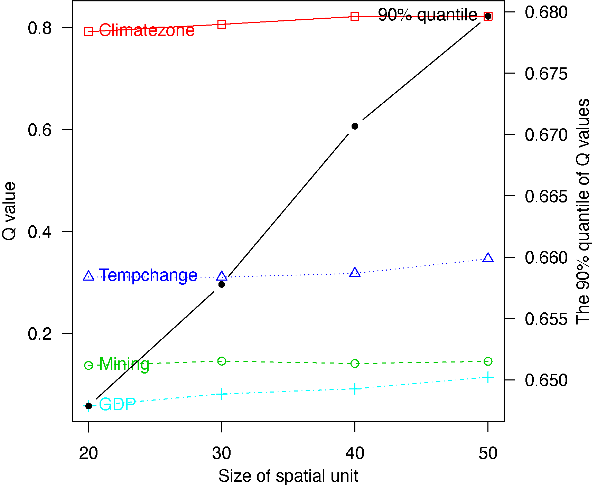

```{r setup, include=FALSE}
knitr::opts_chunk$set(echo = TRUE, fig.path = 'figs/')
```


&nbsp; 

&nbsp; 

`Current version: GD v1.9`

`Total downloads: 13,300 (June 2020)`

&nbsp; 

&nbsp; 


### Citation for package `GD`

To cite **`GD` R package** in publications, please use:

**Song, Y., Wang, J., Ge, Y. & Xu, C. (2020) "An optimal parameters-based geographical detector model enhances geographic characteristics of explanatory variables for spatial heterogeneity analysis: Cases with different types of spatial data", GIScience & Remote Sensing. 57(5), 593-610. doi: [10.1080/15481603.2020.1760434][7].**


&nbsp; 

&nbsp; 


### Authors’ affiliations

#### Dr. Yongze Song

[Google Scholar][6]

Research interests: Spatial statistics, sustainable infrastructure

Curtin University, Australia

Email: yongze.song@curtin.edu.au

**Award:**

**Global Peer Review Awards 2019: Top reviewers in Geosciences (top 1%) and in Cross-field (top 1%).**

&nbsp; 

&nbsp; 

## 1. Introduction to `GD` package

### The model can be used to address following issues:

- Explore potential factors or explanatory variables from a spatial perspective.

- Explore potential interactive impacts of geogrpahical variables.

- Identify high-risk or low-risk regions from potential explanatory variables. 

### The `GD` package makes following steps fast and easy:

- It contains both supervised and unsupervised spatial data discretization methods, and the optimal spatial discretization method for continuous variables; 

- It contains four primary functions of geographical detectors, including factor detector, risk detector, interaction detector and ecological detector;

- It can be used to compare size effects of spatial unit;

- It provides diverse visualizations of spatial analysis results;

- It contains detailed significance tests for spatial analysis in each step of geographical detectors. 


### Start from the *one-step function*: `gdm` (*Highly Recommended*)

The pacakge provides a one-step function for performing optimal discretization and geographical detectors at the same time.  

**The output contains all data and visualization results.**

```{r, eval = FALSE}
## install and library the pacakge
install.packages("GD")
library("GD")

## Example 1
## NDVI: ndvi_40
## set optional parameters of optimal discretization
## optional methods: equal, natural, quantile, geometric, sd and manual
discmethod <- c("equal","natural","quantile")
discitv <- c(4:6)
## "gdm" function
## In this case, Climatezone and Mining are categorical variables,
## and Tempchange and GDP are continuous variables.
ndvigdm <- gdm(NDVIchange ~ Climatezone + Mining + Tempchange + GDP,
               continuous_variable = c("Tempchange", "GDP"),
               data = ndvi_40,
               discmethod = discmethod, discitv = discitv) # ~3s
ndvigdm
plot(ndvigdm)

## Example 2
## H1N1: h1n1_100
## set optional parameters of optimal discretization
discmethod <- c("equal","natural","quantile","geometric","sd")
discitv <- c(3:7)
continuous_variable <- colnames(h1n1_100)[-c(1,11)]
## "gdm" function
h1n1gdm <- gdm(H1N1 ~ .,
               continuous_variable = continuous_variable,
               data = h1n1_100,
               discmethod = discmethod, discitv = discitv)
h1n1gdm
plot(h1n1gdm)
```

 

&nbsp; 

## 2. Geographical detector model

Spatial stratified heterogeneity can be measured using geographical detectors ([Wang et al. 2010][2], [Wang et al. 2016][3]). 

Power of determinants is computed using a $Q$-statistic:

$$Q=1-\displaystyle \frac{\sum_{j=1}^{M} N_{j} \sigma_{j}^2}{N \sigma^2} $$

where $N$ and $\sigma^2$ are the number and population variance of observations within the whole study area, and $N_{j}$ and $\sigma_{j}^2$ are the number and population variance of observations within the $j$ th ($j$=1,…,$M$) sub-region of an explantory variable. 

**Please note that in `R` environment, `sd` and `var` functions are used for computing sample standard deviation and sample variance.** If sample variance is used in the computation, the equation of $Q$-statistic can be converted to:

$$Q=1-\displaystyle \frac{\sum_{j=1}^{M} (N_{j}-1) s_{j}^2}{(N-1) s^2} $$

where $s^2$ and $s_{j}^2$ are sample variance of observations in the whole study area and in the $j$ th sub-region. 

![**Figure 1**. Overview of global research using geographical detector model (*cumulative citations were updated on June 2020*). ([Song et al. 2020][7])](./fig/Figure1.png){width=450px}


![**Figure 2**. General calculation process and relationships of functions in GD package ([Song et al. 2020][7])](./fig/Figure2.png){width=600px}

Further information can be found on the [manual][1] of **GD** package.

More applications of geographical detectors are listed on [Geodetector website][5].

&nbsp;
&nbsp;

## 3. Spatial data discretization

Categorical variables are required for geographical detectors, so continuous variables should be discretized before modelling. **GD** package provides two options: discretization with given parameters, including discretization methods and numbers of intervals, and optimal discretization with a series of optional parameter combinations. Dataset `ndvi_40` is used as an example for explanation.

```{r, eval = FALSE}
install.packages("GD")
```

```{r}
library("GD")
data("ndvi_40")
head(ndvi_40)[1:3,]
```

### Discretization with given parameters: `disc`

```{r, eval = FALSE}
## discretization methods: equal, natural, quantile (default), geometric, sd and manual
ds1 <- disc(ndvi_40$Tempchange, 4)
ds1
plot(ds1)
```

Further information can be found on the [manual][1] of **GD** package.

### Optimal discretization: `optidisc`

```{r, eval = FALSE}
## set optional discretization methods and numbers of intervals
discmethod <- c("equal","natural","quantile","geometric","sd")
discitv <- c(4:7)
## optimal discretization
odc1 <- optidisc(NDVIchange ~ Tempchange, data = ndvi_40,
                 discmethod, discitv)
odc1
plot(odc1)
```


{width=600px}

&nbsp; 

## 4. Geographical detectors

**GD** package provides two options for geographical detectors modelling:

- four functions are performed step by step: `gd` for factor detector, `riskmean` and `gdrisk` for risk detector, `gdinteract` for interaction detector and `gdeco` for ecological detector;

- optimal discretization and geographical detectors are performed using a one-step function `gdm`. 

### Factor detector: `gd`

```{r, eval = FALSE}
## a categorical explanatory variable
g1 <- gd(NDVIchange ~ Climatezone, data = ndvi_40)
g1

## multiple categorical explanatory variables
g2 <- gd(NDVIchange ~ ., data = ndvi_40[,1:3])
g2
plot(g2)

## multiple variables including continuous variables
discmethod <- c("equal","natural","quantile","geometric","sd")
discitv <- c(3:7)
data.ndvi <- ndvi_40

data.continuous <- data.ndvi[, c(1, 4:7)]
odc1 <- optidisc(NDVIchange ~ ., data = data.continuous, discmethod, discitv) # ~14s
data.continuous <- do.call(cbind, lapply(1:4, function(x)
  data.frame(cut(data.continuous[, -1][, x], unique(odc1[[x]]$itv), include.lowest = TRUE))))
    # add stratified data to explanatory variables
data.ndvi[, 4:7] <- data.continuous

g3 <- gd(NDVIchange ~ ., data = data.ndvi)
g3
plot(g3)
```


{width=300px}


### Risk detector: `riskmean` and `gdrisk`

Risk mean values by variables:

```{r, eval = FALSE}
## categorical explanatory variables
rm1 <- riskmean(NDVIchange ~ Climatezone + Mining, data = ndvi_40)
rm1
plot(rm1)
## multiple variables inclusing continuous variables
rm2 <- riskmean(NDVIchange ~ ., data = data.ndvi)
rm2
plot(rm2)
```

Risk matrix:

```{r, eval = FALSE}
## categorical explanatory variables
gr1 <- gdrisk(NDVIchange ~ Climatezone + Mining, data = ndvi_40)
gr1
plot(gr1)
## multiple variables inclusing continuous variables
gr2 <- gdrisk(NDVIchange ~ ., data = data.ndvi)
gr2
plot(gr2)
```


{width=500px}


### Interaction detector: `gdinteract`

```{r, eval = FALSE}
## categorical explanatory variables
gi1 <- gdinteract(NDVIchange ~ Climatezone + Mining, data = ndvi_40)
gi1
## multiple variables inclusing continuous variables
gi2 <- gdinteract(NDVIchange ~ ., data = data.ndvi)
gi2
plot(gi2)
```

{width=400px}


### Ecological detector: `gdeco`

```{r, eval = FALSE}
## categorical explanatory variables
ge1 <- gdeco(NDVIchange ~ Climatezone + Mining, data = ndvi_40)
ge1
## multiple variables inclusing continuous variables
gd3 <- gdeco(NDVIchange ~ ., data = data.ndvi)
gd3
plot(gd3)
```


{width=300px}

&nbsp; 

## 5. Comparison of size effects of spatial unit

```{r, eval = FALSE}
ndvilist <- list(ndvi_20, ndvi_30, ndvi_40, ndvi_50)
su <- c(20,30,40,50) ## sizes of spatial units
## "gdm" function
gdlist <- lapply(ndvilist, function(x){
  gdm(NDVIchange ~ Climatezone + Mining + Tempchange + GDP,
      continuous_variable = c("Tempchange", "GDP"),
      data = x, discmethod = "quantile", discitv = 6)
})
sesu(gdlist, su) ## size effects of spatial units
```


{width=350px}

&nbsp; 

## Reference

Song Y, Wang J, Ge Y and Xu C (2020) "An optimal parameters-based geographical detector model enhances geographic characteristics of explanatory variables for spatial heterogeneity analysis: Cases with different types of spatial data." GIScience & Remote Sensing, 57(5), pp. 593-610. doi: [10.1080/15481603.2020.1760434][7].

Song Y, Wu P, Gilmore D and Li Q (2020). “A Spatial Heterogeneity-Based Segmentation Model for Analyzing Road Deterioration Network Data in Multi-Scale Infrastructure Systems.” IEEE Transactions on Intelligent Transportation Systems. doi: [10.1109/TITS.2020.3001193][9].

Song Y, Wright G, Wu P, Thatcher D, McHugh T, Li Q, Li SJ and Wang X (2018). "Segment-Based Spatial Analysis for Assessing Road Infrastructure Performance Using Monitoring Observations and Remote Sensing Data". Remote Sensing, 10(11), pp. 1696. doi: [10.3390/rs10111696][8].

Song Y, Wang X, Wright G, Thatcher D, Wu P and Felix P (2019). “Traffic Volume Prediction With Segment-Based Regression Kriging and its Implementation in Assessing the Impact of Heavy Vehicles.” IEEE Transactions on Intelligent Transportation Systems, 20(1), pp. 232 - 243. doi: [10.1109/TITS.2018.2805817][4].

Wang J, Li X, Christakos G, Liao Y, Zhang T, Gu X and Zheng X (2010). “Geographical Detectors-Based Health Risk Assessment and its Application in the Neural Tube Defects Study of the Heshun Region, China.” International Journal of Geographical Information Science, 24(1), pp. 107-127. doi: [10.1080/13658810802443457][2].

Wang J, Zhang T and Fu B (2016). “A measure of spatial stratified heterogeneity.” Ecological Indicators, 67, pp. 250-256. doi: [10.1016/j.ecolind.2016.02.052][3].


&nbsp; 


[1]: https://CRAN.R-project.org/package=GD
[2]: https://www.tandfonline.com/doi/abs/10.1080/13658810802443457
[3]: https://www.sciencedirect.com/science/article/pii/S1470160X16300735?via%3Dihub
[4]: https://ieeexplore.ieee.org/document/8307463/
[5]: http://www.geodetector.cn
[6]: https://scholar.google.com.au/citations?user=bNuxvgIAAAAJ&hl=en&oi=ao
[7]: https://doi.org/10.1080/15481603.2020.1760434
[8]: https://doi.org/10.3390/rs10111696
[9]: https://ieeexplore.ieee.org/document/9123684

&nbsp; 
&nbsp; 
